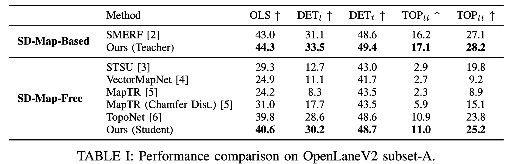
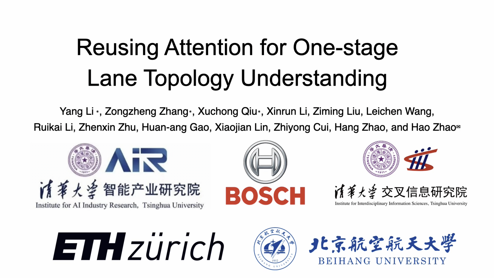

<div align="center">
<h2>Reusing Attention for One-Stage Lane Topology Understanding</h2>

**Yang Li**<sup>1,4*</sup> ·**Zongzheng Zhang**<sup>1,2*</sup> · **Xuchong Qiu**<sup>2*</sup> · **Xinrun Li**<sup>2</sup> · **Ziming Liu**<sup>2</sup> · **Leichen Wang**<sup>2</sup> <br>
**Ruikai Li**<sup>5</sup> · **Zhenxin Zhu**<sup>1</sup> · **Huan-ang Gao**<sup>2</sup> · **Xiaojian Lin**<sup>1</sup> · **Zhiyong Cui**<sup>2</sup> · [**Hang Zhao**](https://hangzhaomit.github.io/)<sup>3</sup> · [**Hao Zhao**](https://sites.google.com/view/fromandto/)<sup>1</sup>

<sup>1</sup> Institute for AI Industry Research (AIR), Tsinghua University. <sup>2</sup> Bosch Corporate Research. <br>
<sup>3</sup> Institute for Interdisciplinary Information Sciences (IIIS), Tsinghua University. <br>
<sup>4</sup> Department of Computer Science, ETH. <sup>5</sup> State Key Lab of Intelligent Transprotation System, Beihang University. <br>
<sub>(* indicates equal contribution)</sub>
</div>

# Overview 
Understanding lane toplogy relationships accurately is critical for safe autonomous driving. However, existing two-stage methods suffer from inefficiencies due to error propagations and increased computational overheads. To address these challenges, we propose a one-stage architecture that simultaneously predicts traffic elements, lane centerlines and topology relationship, improving both the accuracy and inference speed of lane topology understanding for autonomous driving. Our key innovation lies in reusing intermediate attention resources within distinct transformer decoders. This approach effectively leverages the inherent relational knowledge within the element detection module to enable the modeling of topology relationships among traffic elements and lanes without requiring additional computationally expensive graph networks. Furthermore, we are the first to demonstrate that knowledge can be distilled from models that utilize standard definition (SD) maps to those operates without using SD maps, enabling superior performance even in the absence of SD maps. Extensive experiments on the OpenLane-V2 dataset show that our approach outperforms baseline methods in both accuracy and efficiency, achieving superior results in lane detection, traffic element identification, and topology reasoning.

## Results


## Demo Video
[](https://youtu.be/erIOQVbZYug)

## Dataset Setup
Follow the [SMERF repo](https://github.com/NVlabs/SMERF/tree/main) to download and process the data. 

## Installation
### Prerequisites
- Linux
- Python 3.8.19 
- NVIDIA GPU + CUDA 11.1 
- PyTorch 1.10.1

### Environment Setup
TODO

## Train

### One-Stage (No SD Maps)
```bash
bash tools/distributed_merged_train.sh 4
```

### One-Stage (with SD Maps)
```bash
bash tools/distributed_train_one_stage_smerf.sh 4
```

### Distillation
[Use the `distillation+half_dim` branch](https://github.com/Yang-Li-2000/one-stage/tree/distillation%2Bhalf_dim).


## Evaluate

### One-Stage (No SD Maps)
```bash
bash tools/distributed_merged_test.sh 1
```

### One-Stage (with SD Maps)
```bash
bash tools/distributed_test_one_stage_smerf.sh 1
```

### Distillation
[Use the `distillation+half_dim` branch](https://github.com/Yang-Li-2000/one-stage/tree/distillation%2Bhalf_dim).

## License
All assets and code are under the [Apache 2.0 license](./LICENSE) unless specified otherwise.
